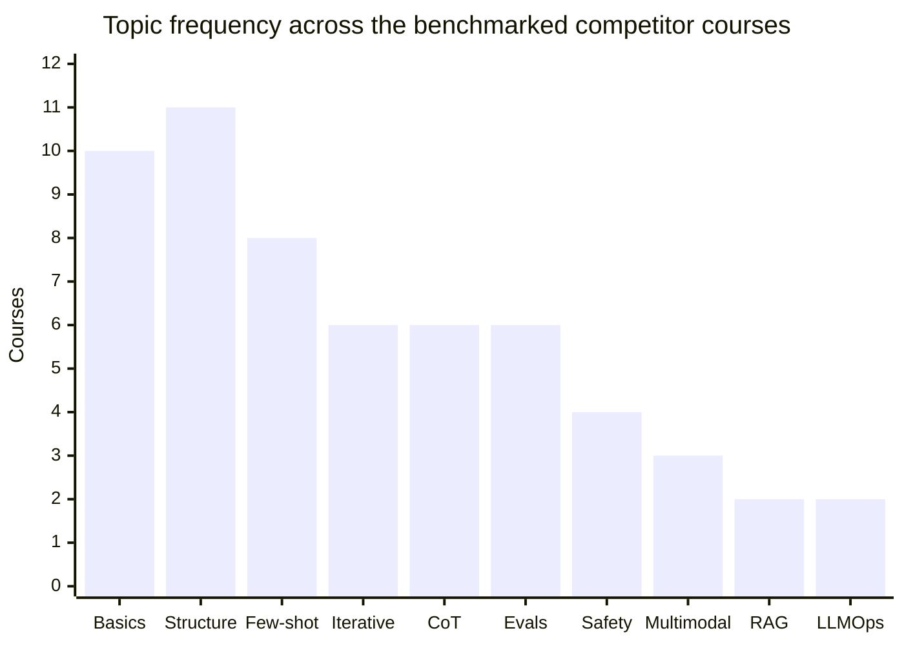

# Seekvana Prompt Engineering Course Strategy

## Executive summary

Seekvana's public positioning already creates a strong strategic opening for a prompt-engineering product. The homepage promises learning "from your first prompt to production-grade agents" and foregrounds Prompting, RAG, and Evals alongside a "production focused" and "practical examples" brand voice. But the current public footprint is thin: the Prompt Engineering topic exists as a library category yet currently has **0 articles**; the site shows **one** public learning path ("Getting Started"), and prompt-related coverage today is mostly scattered across glossary pages, one LLM explainer, one prompt-adjacent mindset article, a future curriculum item called "Prompt patterns that work across all tools," and an AI Tools article that mentions how to structure prompts for Claude Fable 5. In other words, the brand promise is ahead of the syllabus.

The competitor market breaks into three broad groups. First, broad beginner courses focused on ChatGPT-style prompting and reusable patterns, led by Vanderbilt/Coursera, IBM, DeepLearning.AI, and regional players such as upGrad, Great Learning, and Simplilearn. Second, model- or developer-specific courses that go deeper into workflow engineering, prompt evaluation, tool use, and production concerns, especially Anthropic's Claude API course and DeepLearning.AI's Llama course. Third, enterprise/vendor microlearning from Google and Microsoft, which tends to be shorter, narrower, and skill-badge oriented.

Across the benchmarked syllabi, the most common topics are basics, prompt structure, context, personas, formatting, and few-shot/in-context learning. Topics that remain visibly under-taught in public course pages are production eval workflows, RAG mechanics, retrieval quality control, tool use and agent prompting, multimodal prompt design, prompt security, prompt tuning, RLHF/instruction-tuning context, caching/cost controls, and LLMOps-style operationalisation. That gap is where Seekvana can differentiate. It should **not** launch as another "ChatGPT prompts for beginners" course. It should launch as a compact, article-first course on **reliable prompting for agents, apps, and advanced workflows**.

The strongest commercial option for Seekvana is therefore a compact curriculum with two layers. The minimal ten-lesson track should give learners a fast route from prompt basics to evals, context engineering, tool use, multimodal work, safety, and production debugging. The full thirty-article track should expand that into a modern prompt-systems curriculum with labs, notebooks, reusable templates, prompt regression tests, a graded capstone, a community prompt library, and a practical certificate exam. That product would align tightly with Seekvana's existing beginner-to-builder brand while avoiding the saturated "prompt tips" end of the market.

## Audit of Seekvana today

Seekvana's information architecture is promising. Its public site already positions Prompt Engineering as one of nine core topic areas, alongside LLMs, RAG-adjacent material, tools, and agentic AI. It also presents itself as free, beginner-friendly, and pathway-led. The weakness is execution depth: prompt-related depth is currently much stronger in positioning copy and glossary definitions than in actual article inventory or structured coursework.

| Asset | What exists publicly today | Prompt relevance | Strategic implication |
|---|---|---|---|
| Homepage positioning | Seekvana promises learning "from your first prompt to production-grade agents," highlights Prompting, RAG, and Evals, and markets itself as beginner-friendly, production-focused, expert-crafted, and practical. | Very high | The brand promise already supports a serious prompt course; no rebranding needed. |
| Library overview | The library shows **59 articles across 9 topics** and includes a dedicated Prompt Engineering topic area. | High | Prompt engineering is already a visible category in the taxonomy. |
| Prompt Engineering topic page | The topic page exists, describes "techniques, patterns, and frameworks that actually work," but currently shows **0 articles** and "No articles yet — check back soon." | Critical | This is the clearest content gap and the cleanest place to launch a course/article series. |
| Learning paths hub | The public path hub shows **one** path: Getting Started. | Medium | Prompting is not yet packaged as a standalone path or course. |
| Getting Started path | Beginner, free, **10 modules**, **101 topics**, **3–5 hours**, no prerequisites. | High | Seekvana already knows how to structure micro-lessons and tasks; the prompt course should reuse that format. |
| Prompt topics inside the current path | The path includes prompt-adjacent lessons such as "01.03 How Large Language Models Actually Work," "05.09 Your First Claude API Call in Python," and "08.10 Prompt patterns that work across all tools." | High | Prompting exists as a thread inside the builder path, but not yet as its own coherent syllabus. |
| Glossary | The glossary has **35 terms** and explicitly includes Prompt, Prompt Engineering, System Prompt, RAG, Temperature, Tool Use, Context Window, Fine-tuning, and LLM. | High | Seekvana already has definitional scaffolding that can be reused as sidebars, prerequisites, and glossary links inside a course. |
| LLM topic area | The LLM topic area currently has **1 article**, "How Large Language Models Actually Work, No Math Required." | Medium | Helpful prerequisite coverage exists, but not prompt technique depth. |
| AI Foundations article | "How to think about AI" teaches a basic but important prompting idea: context and specificity. | Medium | Good conceptual on-ramp for novice learners, but not enough for a course. |
| AI Tools topic area | AI Tools has **6 articles**, including "How to Use Claude Fable 5: Sub-Agents, Vision, Setup," which explicitly mentions structuring prompts to use the model well. | Medium | Seekvana already writes about advanced AI usage; the prompt course can cross-link into tool-specific applied lessons. |

The biggest gaps are straightforward. Seekvana has **no public prompt article series, no standalone prompt course, no prompt labs, no downloadable prompt templates, no prompt evaluation framework, no prompt security coverage, no model-comparison labs, no visible certification, and no community prompt library** on the audited pages. That absence is especially striking because the site's homepage already claims Prompting, RAG, and Evals as first-class learning areas. This mismatch between promise and inventory is the central opportunity.

## Competitor benchmark

Prioritised official English-language course pages and public syllabi. Where prices or lesson lists were not public, marked as unavailable rather than inferred. The strongest benchmark set is a mix of general prompt courses, developer/model-specific training, enterprise microlearning, and regionally relevant South Asian providers.

| Course | Provider | Price if public | Target audience | Duration and format | Public syllabus highlights | Prerequisites | Learning outcomes and USP |
|---|---|---:|---|---|---|---|---|
| **Prompt Engineering for ChatGPT** | Vanderbilt University on Coursera | Not stated on the course page; free enrolment / paid certificate track via Coursera | Anyone with basic computer usage and ChatGPT access | ~19 hours, beginner, self-paced | Intro to prompts; persona pattern; adding new information; question refinement; cognitive verifier; audience persona; flipped interaction; few-shot examples; CoT; ReAct; grading with LLMs; template, recipe, semantic filter; final prompt-based application | Basic computer usage only | Strongest public "prompt pattern library" course; highly reusable mental models for non-technical learners |
| **Advanced Prompt Engineering for Everyone** | Vanderbilt University on Coursera | Not stated publicly on the page | Intermediate learners already familiar with GenAI | ~9 hours, 5 modules, self-paced | Writing persona; iterative refinement; in-context learning; prompt components; classification/clustering/prediction/recommendation via prompts; markdown templates; self-consistency and fact-checking; RAG overview, search/databases/embeddings, chunk size and noise | Recommended prior familiarity with GenAI | One of the better bridges from everyday prompting into context engineering, structured outputs, and RAG |
| **ChatGPT Prompt Engineering for Developers** | DeepLearning.AI in partnership with OpenAI | Audit access available; DeepLearning.AI Pro starts from platform-level pricing after trial | Beginner developers; also suitable for advanced ML engineers entering prompting | 1h30m, 9 video lessons, code examples, notebook-based | Guidelines; iterative prompting; summarising; inferring; transforming; expanding; chatbot; API-first workflows; transcript also discusses instruction tuning and RLHF context | Basic Python | Best compact developer entry point; practical notebook-first course tied to real API usage rather than only chat UI usage |
| **Prompt Engineering with Llama 2&3** | DeepLearning.AI with Meta | Free enrolment during platform beta; certificate via Pro | Learners interested in model-specific prompting | 1h53m, 10 lessons, code examples | Llama model overview; getting started; multi-turn conversations; prompt techniques; model comparison; Code Llama; Llama Guard; helper functions | None stated publicly | Strong model-specific benchmark; unusually good at combining prompting, code use cases, and safety checks |
| **Generative AI: Prompt Engineering Basics** | IBM on Coursera | Public page shows free trial / certificate track; exact price not stated | Professionals, executives, students, AI enthusiasts; beginner-friendly | 3 modules, self-paced | Concepts and tools; labs on naive prompting and persona pattern; text-to-text prompting; interview pattern; CoT; ToT; playoff method; multimodal prompts; image generation prompting; prompt hacks; watsonx Prompt Lab; final project | No programming required | One of the broadest beginner syllabi; notable for multimodal work, image prompting, and explicit "prompt hacks" coverage |
| **Prompt Design in Agent Platform** | Google Skills | Not publicly stated on the page | Introductory learners using Google's Agent Platform; especially marketing-flavoured business use cases | 1 hour, skill badge / challenge-lab format | Prompt engineering; image analysis; multimodal generative techniques; guided output control; Gemini use in marketing scenarios; challenge assessment | Not stated publicly | Short, badge-oriented competitor with explicit multimodal emphasis and applied platform validation |
| **Create effective prompts for generative AI training tools** | Microsoft Learn | Free | Beginner learners across education and business roles | 7-unit self-paced module | Intro; prompt-based GenAI models; what prompt engineering is; types of instructions; create effective prompts; assessment; summary | None stated publicly | Lightweight but clear enterprise-friendly baseline; good example of role-based, practical microlearning |
| **Building with the Claude API** | Anthropic Academy | **Free** | Backend, full-stack, data, DevOps, architecture, and software engineering audiences | Self-paced comprehensive video course; public page lists extensive curriculum | API basics; multi-turn chat; system prompts; temperature; streaming; structured data; prompt eval workflow; XML-tag prompting; examples; tool use; web search; RAG; chunking; embeddings; BM25; extended thinking; image/PDF support; citations; prompt caching; MCP; Claude Code; Computer Use; agents and workflows | Python proficiency; basic JSON | The deepest production-grade prompt course in the benchmark. It extends prompt engineering into evals, RAG, tools, multimodality, context management, apps, and operational workflows |
| **Advanced Prompt Engineering** | Learn Prompting | **$21/month** billed annually for Plus; free 3-day trial | AI developers, ML enthusiasts, professionals, researchers | 3 days, self-paced; video, exercises, quizzes | In-context learning; few-shot; SG-ICL; CoT; Thread-of-Thought; Contrastive CoT; Self-Ask; Tab-CoT; least-to-most; plan-and-solve; program-of-thoughts; self-evaluation; self-refine; CoVe; System 2 Attention; Rephrase-and-Respond; RE2 | None stated publicly, but clearly aimed above beginner level | The best public benchmark for reasoning-technique breadth and modern prompting taxonomies |
| **Free Prompt Engineering with ChatGPT Course Online with Certificate** | upGrad | **100% free** | Students, working professionals, AI enthusiasts, career switchers, creators | 2 hours; 33 lessons; 13 videos; 3 quizzes; self-paced | What/why of prompts; engineering a good prompt; language-task prompting; code-related prompting; CoT; few-shot prompting; temperature control; context setting; prompt chaining; query optimisation | None stated publicly | Strong regional benchmark: short, practical, explicitly hands-on, and pitched as advanced but accessible |
| **Prompt Engineering for ChatGPT** | Great Learning Academy | Free to learn; certificate fee applies | Beginners; writers, marketers, developers, analysts, founders, students, business users | 3 hours; 8 modules; self-paced | LLM training/inference; OpenAI journey and GPT training; tokenisation; model deployment and tokens; operationalising GenAI; intro to prompt engineering; ChatGPT 4.5 / o1 / o3-mini; hands-on sample prompts; zero-shot; few-shot; role-based; instruction prompts; refinement | None; beginner-friendly | Strong regional benchmark with more model-awareness than many beginner courses and explicit operational context |
| **Free Prompt Engineering Course with Certificate** | Simplilearn SkillUp | Free | AIML engineers, chatbot developers, PMs, software engineers, data scientists, beginners and professionals | Self-paced; exact duration not publicly stated; 90-day access | Intro; what is prompt engineering; demo; what is prompt tuning; AI and language-model fundamentals; consistent-result triggers; refinement; creative AI collaboration; bias detection and mitigation | None required | Useful benchmark because it is one of the few beginner public pages that explicitly names **prompt tuning** and **bias mitigation** |

Taken together, the table shows that the most saturated part of the market is the **front end** of prompt education: definitions, clear instructions, personas, few-shot examples, and general "better prompts" advice. The least saturated part is the **back end**: evaluating prompts against test sets, controlling retrieved context, using prompts with tools and agents, hardening against injection and hallucination, and operationalising prompts inside real products. Anthropic is the clearest outlier here; Vanderbilt's advanced course is the best mainstream bridge into structured prompting and RAG; Learn Prompting is the richest public source on advanced reasoning techniques; regional providers compete mainly on speed, price, and accessibility.

## Topic frequency and curriculum signals

Coded the public syllabi of the twelve benchmarked courses for topic presence. The counts below therefore reflect **publicly advertised** topics, not hidden lesson material or private classroom content. The broad pattern is clear: basics dominate; modern production topics remain scarce.

The chart makes the central product insight visible. Public competitors teach learners how to **write prompts**. Far fewer teach them how to **build prompt systems**.

| Tier | Topics extracted from competitor syllabi | Frequency in the benchmark | Novelty signal | What Seekvana should do |
|---|---|---:|---|---|
| Beginner | Foundations of prompting; prompt anatomy; clarity and constraints; personas; format control; zero-/few-shot basics; iterative refinement | High | Established / crowded | Cover these quickly and cleanly, but do not spend the whole course here |
| Intermediate | CoT-style reasoning; task-specific prompts for writing, analysis, and code; structured outputs; basic evaluation; multimodal basics | Moderate | Still common, but not fully commoditised | Use these as the middle of the minimal track |
| Advanced | Self-refinement and verification; model-specific prompting; RAG and retrieval quality; chunking and embeddings; safety, hallucinations, prompt hacks | Low-to-moderate | Under-taught and differentiating | Make these core pillars of Seekvana's differentiation |
| Professional / Research | RLHF context; prompt tuning vs fine-tuning; formal eval loops; tool-use prompting; MCP; agent/workflow design; caching/cost controls; LLMOps-style operationalisation | Very low | Frontier / scarce in public courses | This is the highest-value white space for Seekvana |

A practical frequency summary of the most useful topics is as follows: prompt structure/context/persona/formatting (**11** of 12), foundations (**10**), few-shot/in-context learning (**8**), iterative refinement (**6**), CoT and reasoning scaffolds (**6**), evaluation/fact-checking (**6**), code prompting (**4**), model-specific prompting (**4**), safety/bias/hallucination/prompt-hack topics (**4**), multimodal prompting (**3**), RAG (**2**), embeddings/chunking/search (**2**), LLMOps/operationalisation (**2**), system prompts (**1**), prompt tuning (**1**), RLHF context (**1**), tool-use/agents/MCP (**1**), and prompt caching/cost optimisation (**1**). That distribution strongly suggests that a modern, differentiated course should move fast through the first six topics and over-invest in the last eight.

## Proposed Seekvana curriculum

Seekvana's best course should sit exactly where its current public brand already points: between beginner prompting and production-grade agentic systems. The curriculum should therefore be **compact, article-first, lab-backed, and aggressively modern**. It should teach prompt engineering as the craft of designing **reliable AI interactions**, not merely as "writing better instructions." That framing fits Seekvana's existing homepage promise and fills the gap left by the currently empty Prompt Engineering section.

**Minimal ten-lesson track**

| Lesson | Article title | Learning objective | Est. words | Hands-on exercise or project | Prerequisites | Assessment |
|---|---|---|---:|---|---|---|
| 1 | **Prompt Engineering vs Context Engineering** | Understand what a prompt can solve, what context must solve, and when prompting is the wrong tool | 1,800 | Diagnose five failure cases and label each as prompt issue, context issue, retrieval issue, or eval issue | None | 8-question quiz |
| 2 | **How Instruction-Tuned LLMs Actually Follow Instructions** | Learn messages, role hierarchy, token limits, and why clarity beats cleverness | 2,000 | Rewrite bad prompts into task–context–constraints–output format | None | Short rewrite assignment |
| 3 | **The Prompt Anatomy Framework** | Master task, audience, constraints, examples, output schema, and acceptance criteria | 2,200 | Build a reusable prompt template for research, writing, and coding tasks | Lesson 2 | Template submission |
| 4 | **Reasoning Patterns That Still Matter** | Use few-shot, CoT, self-ask, plan-and-solve, and when not to use them | 2,200 | Compare zero-shot, few-shot, and scaffolded prompts on one benchmark task | Lessons 1–3 | Mini lab with rubric |
| 5 | **Structured Outputs and Reliable Formatting** | Control JSON, tables, markdown, citations, and schema-first outputs | 1,900 | Create a schema-constrained extraction prompt and test edge cases | Lessons 1–4 | Auto-checked output test |
| 6 | **Prompt Evals for Humans Who Ship Things** | Build tiny gold sets, pairwise comparisons, regression tests, and failure taxonomies | 2,300 | Create a 15-case prompt eval sheet and score two prompt versions | Lessons 1–5 | Graded eval worksheet |
| 7 | **RAG and Long-Context Prompting** | Learn query formulation, retrieval boundaries, chunk quality, citation patterns, and context packing | 2,200 | Prompt a retrieval-backed assistant and diagnose retrieval noise | Lessons 1–6 | Notebook or spreadsheet lab |
| 8 | **Tools, Functions, and Agentic Prompts** | Design prompts for tool choice, action planning, stop conditions, retries, and hand-offs | 2,100 | Write system + tool prompts for a simple web-research agent | Lessons 1–7 | Scenario-based assignment |
| 9 | **Multimodal and Safety-Critical Prompting** | Prompt with text, image, PDF, and UI screenshots; defend against injection, bias, and hallucinations | 2,300 | Red-team a document QA prompt and patch it | Lessons 1–8 | Red-team report |
| 10 | **Shipping Prompt Systems in Production** | Learn versioning, caching, cost, latency, rollback, and monitoring, then assemble a final system | 2,400 | Capstone: ship a small evaluated assistant for a real workflow | Lessons 1–9 | Graded capstone |

**Full thirty-article comprehensive track**

| Module | Articles and estimated word counts | Core learning objectives | Suggested hands-on work | Prerequisites | Assessment types |
|---|---|---|---|---|---|
| **Foundations of modern prompting** | **Prompting vs context engineering** (1,500); **How instruction-tuned models work** (1,700); **Tokens, context windows, and failure modes** (1,600) | Build the right mental model before technique memorisation | Failure diagnosis worksheet; token counting exercise | None | Quiz + reflection |
| **Prompt anatomy and output control** | **Task–context–constraints–criteria** (1,800); **Personas, roles, and voice** (1,600); **Schemas, JSON, tables, and citations** (1,900) | Move from vague prompting to specification-driven prompting | Template library starter pack | Module 1 | Prompt rewrite drill |
| **High-value prompting patterns** | **Zero-shot and few-shot done properly** (1,700); **Example selection and anti-patterns** (1,700); **Prompt chaining without chaos** (1,800) | Learn the small set of patterns that actually transfer across models | Compare four prompt variants on the same task | Modules 1–2 | Lab rubric |
| **Reasoning and decomposition** | **Chain-of-thought and when to avoid it** (1,800); **Self-ask, least-to-most, and plan-and-solve** (1,900); **Verification and self-refinement loops** (2,000) | Make prompts more reliable on multi-step tasks | Reasoning benchmark notebook | Modules 1–3 | Benchmark scorecard |
| **Evals and debugging** | **How to build a micro-eval set** (1,900); **Rubrics, pairwise comparisons, and judge prompts** (2,000); **Debugging hallucinations, drift, and brittle prompts** (2,100) | Introduce an engineer's workflow for prompt quality | Build a 20-case regression sheet | Modules 1–4 | Graded eval pack |
| **Context engineering and RAG** | **What RAG changes about prompting** (1,900); **Chunking, retrieval noise, and citation prompts** (2,100); **Long-context prompts that do not collapse** (2,000) | Teach grounded prompting rather than generic prompting | Retrieval sandbox lab | Modules 1–5 | Lab + short quiz |
| **Tool use and agent prompting** | **Designing tool-aware system prompts** (2,000); **Planning, stopping, and error recovery** (2,000); **Multi-agent prompt hand-offs and role boundaries** (2,100) | Turn prompts into orchestrated workflows | Build a small tool-use agent spec | Modules 1–6 | Scenario exercise |
| **Multimodal prompting** | **Prompting with images and screenshots** (1,800); **Working with PDFs, tables, and scanned documents** (1,900); **Cross-modal prompts for research and reporting** (2,000) | Extend prompting beyond pure text | Analyse an image/PDF workflow | Modules 1–7 | Practical lab |
| **Safety and robustness** | **Prompt injection and jailbreak basics** (2,000); **Bias, tone, and refusal policies** (1,800); **Safe prompting checklists for production teams** (1,900) | Add defensive prompting and governance habits | Red-team and patch an assistant | Modules 1–8 | Red-team brief |
| **Prompt ops and capstone** | **Versioning, monitoring, and rollback** (2,000); **Caching, latency, and cost-aware prompts** (1,800); **Capstone briefing and certification prep** (1,700) | Connect prompt craft to operations and proof of competence | Final evaluated assistant project | Modules 1–9 | Capstone + certification exam |

This structure deliberately teaches **more advanced content in fewer articles** than most competitors. Instead of spending ten articles on generic ChatGPT tips, it uses the first three to establish a precise mental model, then moves quickly into evals, context engineering, tool use, multimodality, safety, and operations. That is the cleanest way to be both compact and differentiated.

## Positioning, pedagogy, and naming

The most defensible value proposition for Seekvana is: **"Learn prompt engineering as a production skill, not a bag of tricks."** Competitors already cover simple prompt writing very well. What remains scarce is a course that explains how prompts behave inside **real AI systems**: with retrieval, tools, evaluations, multimodal inputs, costs, safety constraints, and model differences. That is especially compatible with Seekvana because the site already spans LLMs, RAG, evals, building with AI, AI tools, and agentic AI, rather than living only in the ChatGPT-tips category.

A strong pedagogical design would combine **micro-articles** with **structured practice**. Each article should be short enough to finish in one sitting, but every article should also include a tested prompt template, a "why this fails" section, and one hands-on task. The best addition beyond articles would be a thin lab layer: side-by-side model comparisons, notebook labs for evals and RAG, downloadable prompt cards, and red-team exercises. Over time, Seekvana could extend that into a community prompt library, "prompt packs" by workflow, and a practical certification exam whose capstone is an evaluated assistant rather than a multiple-choice-only badge. That teaching stack would clearly outperform static article libraries while still fitting Seekvana's current content DNA.

A practical product stack would look like this:

| Component | Recommendation for Seekvana | Why it differentiates |
|---|---|---|
| Micro-articles | 1,500–2,200 words each, one idea per article, strong internal linking | Fits Seekvana's current article-led UX and keeps the course compact |
| Prompt templates | Downloadable "prompt cards" with task, context, examples, output schema, failure modes | Turns reading into reuse |
| Interactive labs | Lightweight notebook or spreadsheet labs for evals, RAG, and model comparison | Moves the course from advice to practice |
| Graded projects | One per major block: formatting, evals, RAG, tool use, safety, capstone | Gives portfolio value |
| Community prompt library | Curated prompt patterns by workflow and model, with ratings and known failure cases | Builds retention and moat |
| Certification exam | Practical exam: improve a broken prompt system and justify changes with eval evidence | Better signal than recall-based quizzes alone |

**Candidate course names**

| Candidate name | What it signals | Risk |
|---|---|---|
| **Prompt Engineering for Agents and Apps** | Clear, modern, practical, production-oriented | Slightly more technical than a pure beginner title |
| **Modern Prompt Engineering** | Broad and current | Too generic on its own |
| **Context Engineering for AI Builders** | Differentiated and advanced | Lower mainstream search familiarity |
| **Production Prompting** | Strong operator/engineering feel | May sound too advanced for novices |
| **Prompt Systems** | Distinct from "prompt tips" | Slightly abstract without subtitle |
| **Prompt Design for LLM Workflows** | Professional and useful | Less catchy |
| **Reliable Prompts for Real Work** | Benefit-focused and accessible | Less aligned with standard course-search behaviour |
| **From Prompt to Product** | Excellent marketing line | Too broad as the main SEO/course title |

**Best option: _Prompt Engineering for Agents and Apps_**

This is the strongest choice because it balances **clarity**, **search behaviour**, and **differentiation**. It keeps the valuable high-intent phrase **"Prompt Engineering"**, while the second half — **"for Agents and Apps"** — instantly tells learners that this is not another generic ChatGPT course. It also matches Seekvana's public brand language around prompts, builders, apps, and production-grade agents. A strong subtitle would be:

**Prompt Engineering for Agents and Apps**
*Build reliable prompts, context, and evals for real AI systems.*

That title helps Seekvana compete directly with beginner prompt courses while signalling a more modern curriculum.

## Open questions and limitations

Some official providers publish only partial public syllabi, especially vendor learning platforms and some subscription-based courses. In those cases, only lesson or module details visible on official public pages were used, with missing price or syllabus details marked as unavailable rather than inferred. Google Skills and Microsoft Learn are especially concise publicly; Anthropic is unusually transparent; Coursera often exposes module details but not a clean single public price for the certificate track.

The "topic frequency" section is a synthesis of **publicly advertised syllabi**, not a full crawl of locked lesson interiors. That means some advanced topics may be taught inside courses more deeply than their public landing pages reveal. The competitive conclusions are therefore strongest for what prospects can see before buying or enrolling — which is, in practice, the most important part of course positioning and curriculum signalling.
