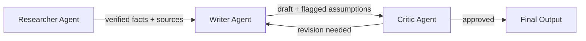

<ArticleImage
  src="/images/articles/agentic-ai/multi-agent-prompting-and-orchestration/cover.webp"
  alt="Illustration of multiple AI agent icons coordinating around a central hub"
  priority
  isCover
/>

A single AI agent that tries to research a topic, write the draft, and fact-check its own work usually does all three jobs a little worse than it would do just one. Multi-agent orchestration is the fix: instead of one agent juggling every role, you give each job to its own agent, with its own prompt, and coordinate how they hand work to each other. Here's how that coordination actually works, laid out clearly, and when it's worth the extra complexity.

> **Key Takeaways**
> - Multi-agent orchestration splits one task into specialized roles, each with its own prompt, rather than asking one agent to do everything
> - The supervisor/worker pattern is the most common structure: a coordinating agent assigns work and reviews results from specialist agents
> - Hand-offs are structured messages, not vague instructions, and they need to include the task, the relevant context, and the expected output format
> - Multi-agent debate, where agents critique each other's output, has been shown to improve factual accuracy over a single agent working alone
> - A single, well-prompted agent still matches multi-agent systems on the majority of tasks, so orchestration is worth the added cost only when roles are genuinely distinct

## What Is Multi-Agent Prompting and Orchestration?

Multi-agent orchestration is the practice of coordinating two or more AI agents, each with a distinct role, prompt, or tool set, so they complete a task together that a single agent would handle worse or not at all. The "prompting" part matters as much as the "orchestration" part: each agent needs a prompt written for its specific job, not a generic instruction reused across every agent in the system.

Think of it like a small newsroom instead of one overworked freelancer. A researcher gathers facts, a writer turns them into a draft, and an editor checks the draft before it ships. Each person is good at one thing. Multi-agent orchestration builds that same division of labor out of AI agents (see the [quick definition of a multi-agent system](/glossary/multi-agent) if you want the one-paragraph version first).

## Role Specialization: Why One Agent Isn't Enough

A single [AI agent](/glossary/agent) trying to research, write, and self-edit runs into a real limit: it's using the same context, the same instructions, and often the same "mode of thinking" for three jobs that actually need different priorities. A research pass rewards thoroughness and skepticism. A writing pass rewards clarity and flow. An editing pass rewards catching what the first two passes missed.

If you already learned [how agents call tools](/library/agentic-ai/agentic-prompting) to complete a single task, role specialization is the next step up: instead of one agent switching hats, you build separate agents that never have to switch.

That separation matters because it breaks in real projects when skipped. A single agent asked to "research and write" a technical explainer will often invent a plausible-sounding fact mid-draft, because it's in writing mode and not actively fact-checking anymore. Splitting the roles means the writer never has to be the fact-checker at the same time it's trying to sound good.

## The Supervisor/Worker Pattern

The most common way to organize a multi-agent system is the supervisor/worker pattern. One agent, the supervisor, breaks down the overall task and assigns pieces to worker agents, then reviews what comes back. It doesn't just split work and merge it. It makes real decisions based on what the workers actually produce: retry a step, reassign it, or send a worker back with more specific instructions.

Here's what actually changes in the prompt text. A worker agent's prompt is narrow and specific: "You are a research agent. Given a topic, return five verified facts with sources. Do not write prose." A supervisor's prompt is broader and evaluative: "You are coordinating a research agent and a writing agent. Review the research agent's output for gaps before passing it to the writing agent. If the research is thin, ask for more before proceeding."

I've watched a supervisor agent accept a thin, three-fact research pass without complaint simply because its prompt never said what "enough" looked like. The fix wasn't a smarter model, it was one added sentence telling the supervisor what a good research pass actually contains.

<Tip>
  Write the supervisor's prompt to explicitly name what a "good" worker output looks like. Without that, the supervisor has no way to judge when to retry a step versus accept it.
</Tip>

Skip this pattern, and a single agent quietly absorbs every role change with no one checking its work in between, which is exactly how the invented-fact problem from the last section slips through.

This pattern suits small, focused teams. Production teams building supervisor setups with LangGraph report that four specialist agents work well. A flatter peer-to-peer setup at that size becomes unmanageable, and a deeper multi-level hierarchy is overkill.

<ArticleImage
  src="/images/articles/agentic-ai/multi-agent-prompting-and-orchestration/orchestration-flow.webp"
  alt="Diagram showing a supervisor agent coordinating researcher, writer, critic, and editor agents, with a task moving through the team from user request to final output"
  caption="A supervisor agent assigns work to specialist agents, reviews what comes back, and routes a task through the team until it's ready to ship."
/>

## How Agent Hand-offs Actually Work

A hand-off is the moment one agent's output becomes another agent's input. Done badly, it's just dumping raw text from Agent A into Agent B's prompt and hoping for the best. Done well, it's a structured message with three parts: the task itself, the relevant context Agent B needs (and nothing it doesn't), and the format Agent B should return.

For the research-to-writing hand-off in a research-and-write flow, that structured message might specify the topic, the five facts the research agent found with their sources, and an instruction that the writing agent should produce a draft using only those facts, flagging anywhere it needed to make an assumption.

<Note>
  A hand-off that includes too much raw context, like an entire research transcript instead of the distilled facts, is a common cause of the next agent losing the thread. Trim before you hand off, not after.
</Note>

## Debate and Critique: Using Agents to Check Each Other

Instead of one agent producing an answer and moving on, a debate or critique pattern has two or more agents evaluate the same output from different angles, or argue for competing answers before a judge agent decides. Researchers found that when one agent critiques another's reasoning, factual accuracy improves measurably over a single agent working alone, because the debate forces claims to survive a real challenge instead of just sounding confident.

In plain terms: it's agents checking each other's homework. A writer agent produces a draft, a critic agent reads it looking specifically for unsupported claims, and the writer revises based on that critique before the draft ships. That's a lighter, cheaper version of full multi-agent debate, and it's often enough for content-style tasks.

A single agent can run a version of this same critique-and-retry loop on itself instead of needing a second agent, which is exactly what [Reflexion](/library/agentic-ai/advanced-reasoning-frameworks) does.

Skip this step and the writer agent becomes its own only reviewer, which means the one failure mode most likely to slip through, a confident but unsupported claim, has nobody left to catch it.

## Worked Example: A 3-Agent Research-and-Write Flow

Here's the full flow using everything above, built around three agents: a researcher, a writer, and a critic.

**The three agents in a research-and-write flow**

| Agent | Input | Output |
|---|---|---|
| Researcher | Topic + target number of facts | List of verified facts with sources, flagged if any claim couldn't be confirmed |
| Writer | Researcher's fact list + tone/format instructions | Draft using only the provided facts, with assumptions explicitly marked |
| Critic | Writer's draft + the original fact list | Specific list of unsupported claims or gaps, or approval to ship |

The supervisor here is implicit in the sequence itself: researcher runs first, its output gates whether the writer proceeds (if fewer than the target number of facts come back verified, the supervisor step asks the researcher to try again), and the critic's approval gates whether the draft is final. Each hand-off carries only what the next agent needs, not the full conversation history.

This is a small system, three agents, one linear path with a single revision loop, and that's deliberate. It's easy to see how each addition (a fourth agent for SEO optimization, say) would need its own narrow prompt and its own hand-off contract, not a vague instruction bolted onto an existing agent.

## What Breaks in Multi-Agent Systems

Multi-agent systems fail in specific, well-documented ways, and it's worth knowing them before you build one. An error made by the researcher agent doesn't stay contained. It cascades: a wrong fact from the researcher becomes a confidently written sentence from the writer, which the critic may or may not catch depending on how specifically it was told to check.

<Warning>
  Errors compound across hand-offs. A researcher that's wrong 10% of the time doesn't cost you 10% accuracy overall, it costs you 10% compounded through every downstream agent that trusts its output without re-verifying it.
</Warning>

Cost is the other real tradeoff. A supervisor-coordinated system costs roughly three times what a single well-prompted agent costs to run. Production teams have measured the payoff at around an 18-point lift in success rate on genuinely heterogeneous tasks, and that math only works out when the task actually needs the split.

## When to Use Multi-Agent Orchestration (and When Not To)

Before reaching for a multi-agent system, run a gut-check: does this task have genuinely distinct sub-roles that would fight each other inside one prompt, or am I just making one job feel more sophisticated by splitting it up? Benchmark research has repeatedly found a single agent matches multi-agent systems on the majority of tasks tested, meaning most of the time, one strong agent with a good prompt is enough.

**Single agent vs. multi-agent fit**

| Signal | Favors single agent | Favors multi-agent |
|---|---|---|
| Task structure | One clear goal, one output format | Distinct sub-roles with different priorities (research vs. writing vs. review) |
| Quality control | A single review pass is enough | Output needs independent verification before it ships |
| Cost sensitivity | Budget or latency is tight | The task's value justifies roughly 3x the cost of one agent |
| Failure tolerance | Occasional errors are acceptable | Errors need to be caught before they compound downstream |

Enterprise interest in this space has grown fast, with analysts noting a sharp rise in multi-agent system inquiries through 2025, but interest isn't the same as fit. Reach for orchestration when the roles are genuinely different, not because the architecture sounds more advanced.

Run that decision table against whatever you're building right now. If it points to "single agent," that's not a consolation prize, it's the right call, and you can revisit the split later once the roles actually pull in different directions.

<a href="https://arxiv.org/abs/2305.14325" target="_blank" rel="noopener noreferrer">Multiagent debate research</a> and the <a href="https://reference.langchain.com/python/langgraph-supervisor" target="_blank" rel="noopener noreferrer">LangGraph supervisor reference</a> are both good next reads if you want to see these patterns implemented in code rather than just described in prose. For the layer below this, on how a single agent decides its own next action before you ever add a second one, see [agentic AI systems](/library/agentic-ai).

<FAQ>
  <FAQItem question="Is multi-agent orchestration just running the same prompt on multiple models?">
    No. Running one prompt on several models is redundancy, not orchestration. Multi-agent orchestration gives each agent a distinct role, distinct instructions, and often a distinct tool set, then coordinates how their outputs move between each other. The coordination is the whole point.
  </FAQItem>
  <FAQItem question="Do I need LangGraph or CrewAI to build a multi-agent system?">
    No. A framework like LangGraph or CrewAI manages state and routing for you, which helps at production scale, but the underlying idea is just structured prompts calling other prompts. You can hand-build a 2 or 3-agent flow with plain API calls before reaching for a framework.
  </FAQItem>
  <FAQItem question="Why does my multi-agent system produce worse results than a single well-prompted agent?">
    Usually because the task didn't actually need splitting. Benchmark studies have repeatedly found a single well-prompted agent matches multi-agent systems on the majority of tasks, and every hand-off between agents adds a chance for context to get lost or misinterpreted. If the subtasks aren't genuinely distinct, one strong agent beats several weak ones.
  </FAQItem>
  <FAQItem question="How many agents should a multi-agent system have?">
    Start with the fewest that map to genuinely different roles, usually 2 to 4. Production teams report that supervisor setups work well for small, focused teams of specialists; past 4 or 5 agents, coordination overhead and cost tend to outweigh the benefit unless the task is large enough to justify it.
  </FAQItem>
</FAQ>
