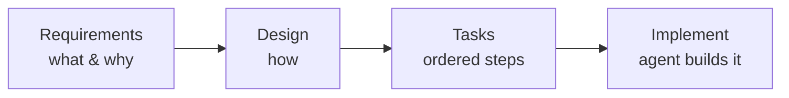

<ArticleImage src="/images/articles/agentic-ai/spec-driven-development/cover.webp" alt="A robot writing a spec in a notebook while a second robot builds from blueprints on the desk" />

I asked Claude Code to "let users export their data." No spec, just that sentence. It came back fast: a button, an endpoint, a CSV download of the account's rows. Clean code, ran on the first try, looked done.

It wasn't. It exported everything, with no date range, no format choice, and no way to skip the fields a user might not want a support agent seeing in a downloaded file. Nothing in my prompt said otherwise, so the agent picked the simplest reading and ran with it.

**Spec-driven development is the practice of writing a versioned specification, covering requirements, design, and tasks, before an agent writes any code, so ambiguity like that gets resolved on the page instead of guessed at in the implementation.** The spec is a real file in your repo, not a conversation that evaporates when you close the tab. Here's what that distinction changes in practice, and how to write one for yourself.

> **Key Takeaways**
> - Spec-driven development means writing requirements, design, and tasks as a committed file before an agent writes code, not just describing the feature in a prompt.
> - Unlike plan mode, a spec persists across sessions, gets reviewed, and can be updated as the feature changes.
> - GitHub Spec Kit (specify → plan → tasks → implement) and AWS Kiro (requirements.md → design.md → tasks.md, written with EARS notation) are the two most-used real-world implementations in 2026.
> - A well-written spec forces decisions, like scope, format, and edge cases, into the open before the agent has to guess at them.

---

## Why Plan Mode Isn't Enough

Plan mode answers a one-sentence version of this question: "what is the agent about to do?" It does not answer the harder one: "what did we actually agree the feature should do, and will anyone else be able to check that later?"

Plan mode in Claude Code or Cursor is genuinely useful. It has you check the agent's intended approach before it touches a single file, and it's saved me from more than one wrong turn. But it lives inside one session. Close the window, or hand the task to a teammate, and that plan is gone; nobody can review it, diff it, or point back to it three weeks later when someone asks why the export feature works the way it does. If you've used [plan mode's ephemeral scope](/library/agentic-ai/plan-and-execute) before, this is the natural next step: the same "decide before you build" instinct, made durable.

A spec fixes exactly that gap. It's a markdown file, checked into version control, that describes what you're building, why, and how, before the agent starts. It can be reviewed the same way a pull request gets reviewed. It survives past the session that created it. And when a new agent picks up the same file later, with zero memory of the conversation that produced it, the spec is still there to read.

## How Spec-Driven Development Actually Works

Every real spec-driven development workflow in production right now, whatever tool implements it, breaks into the same three layers: what to build, how to build it, and the ordered list of steps to get there. Skip straight to prompting without them, and you're back to letting the [agent](/library/agentic-ai) guess at exactly the decisions a spec exists to force into the open.

**<a href="https://github.com/github/spec-kit" target="_blank" rel="noopener noreferrer">GitHub Spec Kit</a>** is the most widely adopted open-source version of this idea. It's MIT-licensed and works with more than 30 AI coding agents, including Claude Code, Cursor, and GitHub Copilot. It structures a feature into four phases: `specify` (the what and why), `plan` (the technical approach), `tasks` (a broken-down list of implementable steps), and `implement` (the agent actually builds it). It has passed 126,000 stars on GitHub, which says less about the code and more about how many teams hit the same "the agent guessed wrong" wall and went looking for a fix.

**AWS Kiro** takes the same shape and builds it into the editor itself. Type a one-line request like "add a review system for products," and <a href="https://kiro.dev/blog/introducing-kiro/" target="_blank" rel="noopener noreferrer">Kiro generates three linked documents</a>: `requirements.md` (user stories with acceptance criteria), `design.md` (data flow, schemas, API shape, matched to your actual codebase), and `tasks.md` (a sequenced implementation plan, each task linked back to the requirement that justifies it). Kiro also keeps these documents synced as the codebase changes, so the spec doesn't quietly drift out of date the way a design doc in a wiki usually does.

**BMAD Method** approaches the same problem from a different angle: instead of one agent following a spec, it simulates a small team, with analyst, project-manager, architect, developer, and <a href="https://medium.com/@visrow/comprehensive-guide-to-spec-driven-development-kiro-github-spec-kit-and-bmad-method-5d28ff61b9b1" target="_blank" rel="noopener noreferrer">QA agents each producing their own artifact</a>, all communicating through shared markdown files. It's worth knowing by name if you see it mentioned, but Spec Kit and Kiro are the two you'll actually reach for day to day.

**Spec Kit vs. Kiro vs. BMAD at a glance**

| | GitHub Spec Kit | AWS Kiro | BMAD Method |
|---|---|---|---|
| Documents produced | spec.md, plan.md, tasks.md | requirements.md, design.md, tasks.md | PRD, architecture, user stories |
| Requirement format | plain prose | EARS notation | user stories + acceptance criteria |
| Works inside | 30+ agents (Claude Code, Cursor, Copilot, and others) | Kiro's own editor | any agent, via its own multi-agent workflow |
| Best fit | teams already using multiple coding agents | teams wanting specs synced automatically to the codebase | teams that want a simulated PM/architect/dev/QA handoff |

<ArticleImage src="/images/articles/agentic-ai/spec-driven-development/requirements-design-tasks-pipeline.webp" alt="Infographic showing the requirements, design, tasks, and implement steps of spec-driven development, alongside an EARS notation template and the export-feature example turned into EARS statements" caption="The same four-step shape, EARS notation template, and the export-feature example from this lesson turned into testable requirements." />

## What Is EARS Notation?

EARS notation is a template for writing a requirement as a single testable sentence, most often in the shape "WHEN [trigger], the system shall [response]." AWS Kiro uses it to turn a vague ask into acceptance criteria a developer, or an agent, can build against and later verify.

EARS was originally developed at Rolls-Royce for writing aircraft-system requirements that had to be unambiguous by necessity, which is a good sign of how seriously it treats fuzzy language. Applied to our export feature, a plain user story like "users can export their data" becomes several EARS statements:

- WHEN a user requests a data export, the system shall generate a file containing only that user's own records.
- WHEN a user selects a date range for export, the system shall include only records within that range.
- WHEN an export exceeds 10,000 rows, the system shall generate the file asynchronously and notify the user when it's ready.

Notice what happened: three decisions that a plain prompt left to the agent's judgment (scope, filtering, size handling) are now explicit, and each one is checkable. That's the whole value of the notation, not the syntax itself.

## Build Log: Writing the Spec for "Let Users Export Their Data"

Here's the actual walkthrough, using the request that started this lesson.

**Requirements.** I opened a new `requirements.md` and wrote three EARS-style statements, close to the ones above, plus one more: WHEN a user requests an export, the system shall let them choose CSV or JSON format. Writing that line out loud is what made me realize something: the plain-prompted version had silently decided CSV was the only option anyone would ever want.

**Design.** In `design.md`, I sketched the actual shape: a new `/exports` endpoint, a background job for anything over the row threshold, and a signed download URL that expires after 24 hours instead of leaving an export file sitting on a server indefinitely. None of that was in my original one-sentence request. All of it came from asking "what does this requirement actually force us to build?"

**Tasks.** `tasks.md` broke the design into six ordered steps: create the export endpoint, add the format parameter, add the async job for large exports, generate signed URLs, write the notification, add tests for each acceptance criterion in requirements.md.

**Implement.** I handed all three files to Claude Code with one instruction: build from the spec, nothing else. The export feature that came back handled formats, date ranges, and the async path correctly, on the first pass, because the ambiguity had already been resolved in the requirements file rather than left for the model to invent mid-generation.

The first time I ran this same feature as a plain prompt, Claude Code shipped a CSV-only export with no date filter, reasonable-looking, wrong for anyone with more than a month of account history. The spec version caught that exact gap during the requirements step, before a single line of code existed. That's the whole pitch for spec-driven development in one comparison.

<Tip>
If you're not sure whether a feature needs a full spec, ask whether a teammate reading only the requirements file, with no other context, could tell you what "done" looks like. If they can't, the spec isn't finished yet.
</Tip>

## Where This Breaks

Spec-driven development isn't free, and pretending otherwise would undersell it. Writing requirements, design, and tasks for a five-minute prototype or a disposable script is pure overhead; you'll spend longer specifying the thing than building it, which defeats the point.

<Warning>
The other failure mode is quieter: a spec that nobody updates after the code changes. An out-of-date `requirements.md` is worse than no spec at all, because it looks authoritative while being wrong. Kiro's approach of syncing specs to the codebase automatically is one answer; the low-tech answer is just treating spec updates as part of the pull request, not an afterthought.
</Warning>

The practical rule that's emerged across most teams doing this in 2026: vibe-code to discover what you actually want, then write the spec before the feature ships. Structured exploration first, a durable spec second.

## Your Lab

<Steps>
  <Step number={1} title="Write requirements.md">
    In Cursor or Claude Code, create a `requirements.md` for the same vague request used in this lesson: "let users export their data." Write at least three EARS-style statements ("WHEN [trigger], the system shall [response]") that force a decision on scope, format, and size handling.
  </Step>
  <Step number={2} title="Write design.md">
    Sketch the technical shape that satisfies those requirements: endpoints, data flow, and any async or storage decisions. Keep it to what the requirements actually demand, not everything you can imagine the feature growing into.
  </Step>
  <Step number={3} title="Write tasks.md">
    Break the design into an ordered list of implementable steps, each one traceable back to a specific line in requirements.md.
  </Step>
  <Step number={4} title="Implement from the spec alone">
    Start a fresh session and give Claude Code only the three files, with the instruction to implement strictly from them. Do not add extra context or clarify verbally, even if you're tempted to.
  </Step>
  <Step number={5} title="Log the ambiguity">
    In `learning-log.md`, write down one specific ambiguity your spec forced you to resolve that a plain prompt would have left the agent to guess at, and what you chose instead.
  </Step>
</Steps>

<Note>
  Done? You've completed Lesson 16.08.
</Note>

<FAQ>
  <FAQItem question="What is spec-driven development?">
    Spec-driven development is the practice of writing a versioned specification, covering requirements, design, and tasks, before an AI coding agent writes any code. The spec becomes the source of truth the agent implements from, so ambiguity gets caught and resolved on the page instead of guessed at inside the generated code.
  </FAQItem>
  <FAQItem question="What is the difference between spec-driven development and plan mode?">
    Plan mode is a conversation-scoped preview inside a single coding session. It disappears when you close the window or start a new one. A spec is a file you commit to the repo, so it survives across sessions, gets reviewed like code, and can be updated as the feature evolves.
  </FAQItem>
  <FAQItem question="What is EARS notation?">
    EARS, short for Easy Approach to Requirements Syntax, is a template for writing requirements as testable statements, most commonly in the form "WHEN [trigger], the system shall [response]." AWS Kiro uses EARS notation to turn a one-line feature request into acceptance criteria an agent can build and be checked against.
  </FAQItem>
  <FAQItem question="Is spec-driven development worth the extra upfront work?">
    For a throwaway script or a five-minute prototype, no, the overhead isn't worth it. For anything that ships to real users, touches multiple files, or will be revisited by someone other than you, a spec pays for itself the first time it catches an ambiguous requirement before the agent has to guess.
  </FAQItem>
</FAQ>
